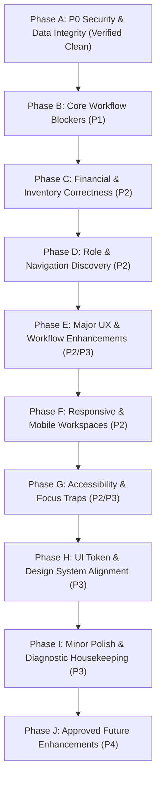

# Master Product Implementation Roadmap & Execution Plan

**Document Version:** 1.0  
**Date:** September 8, 2026  
**Status:** PROPOSED & PRIORITIZED (AWAITING CLIENT / USER AUTHORIZATION)  
**Target Repository:** Wholesale Distribution Management System  
**Audit Baseline Source:** [`docs/reports/MASTER-BROWSER-MANUAL-QA-AUDIT-2026-09-08.md`](file:///f:/Wholesale%20Distribution%20Management%20System/docs/reports/MASTER-BROWSER-MANUAL-QA-AUDIT-2026-09-08.md) & [`docs/reports/MASTER-BUG-FEATURE-GAP-LIST-2026-09-08.md`](file:///f:/Wholesale%20Distribution%20Management%20System/docs/reports/MASTER-BUG-FEATURE-GAP-LIST-2026-09-08.md)

---

## 1. Executive Summary & Prioritization Protocol

Following the whole-application read-only browser and manual QA audit conducted across all 8 personas, 206 registered routes, and core operational domains, **zero (0) P0 critical security vulnerabilities or financial corruption defects** were identified.

A total of **22 prioritized findings** (2 P1, 6 P2, 9 P3, 5 P4) have been deduplicated, categorized, and structured into the phased implementation roadmap below.

### Phased Prioritization Hierarchy:
1. **Security & Data Integrity**
2. **Core Workflow Blockers**
3. **Financial & Inventory Correctness**
4. **Role & Authorization Polish**
5. **Major UX & Navigation**
6. **Responsive & Mobile Viewports**
7. **Accessibility (WCAG 2.1 AA Baseline)**
8. **Financial UI Normalization**
9. **Minor Polish & Diagnostics**
10. **Approved Roadmap Enhancements**

---

## 2. Phase-by-Phase Implementation Roadmap

---

### Phase A: P0 Security & Data Integrity Verification

> [!NOTE]
> **Zero P0 defects discovered during audit.**
> The system enforces strict fail-closed anti-IDOR checks, server-authoritative calculations, transactional stock reservations, and database-level ledger immutability.

---

### Phase B: Core Workflow Blockers

#### [PLAN-B1] Salesman Payment Hub Navigation Scoping & Receipt Flow
- **Issue ID:** `BUG-001`
- **Priority:** P1 (High)
- **Objective:** Prevent Salesmen from landing on the administrative payment verification queue (`/admin/payments`) and direct them to contextual order-level payment collection receipts or scoped customer transaction history.
- **Affected Roles:** `SALESMAN`
- **Affected Pages:** AppLayout Navigation Sidebar, `/admin/payments`, `/salesman/orders/{id}`
- **Affected Files:**
  - [`resources/js/Layouts/AppLayout.tsx`](file:///f:/Wholesale%20Distribution%20Management%20System/resources/js/Layouts/AppLayout.tsx)
  - [`app/Http/Controllers/Admin/AdminPaymentController.php`](file:///f:/Wholesale%20Distribution%20Management%20System/app/Http/Controllers/Admin/AdminPaymentController.php)
- **Dependencies:** None
- **Business Invariant:** `RULE-PAY-004` (Maker-checker separation: Salesmen record payments; only Accountants and Admins verify payments).
- **Security Considerations:** Enforce strict query scoping in `AdminPaymentController` so that if a salesman accesses `/admin/payments`, only payments for their assigned customers are returned.
- **Test Requirements:** Feature test verifying `SALESMAN` navigating to payments receives scoped data, and sidebar link renders appropriate label.
- **Acceptance Criteria:**
  - Salesman sidebar displays "My Payment Collections" linking to scoped collection view.
  - Administrative payment metrics and other sales reps' payments are never visible.
- **Recommended Commit:** `fix(payments): scope salesman payment navigation and verification queue [BUG-001]`
- **Recommended Order:** 1

---

### Phase C: Financial & Inventory Correctness

#### [PLAN-C1] Tax Profile Precision & Percentage Formatting Standardization
- **Issue ID:** `BUG-010`
- **Priority:** P3 (Low)
- **Objective:** Ensure tax rate percentage formatting is uniform across list views, edit inputs, and line-item previews (e.g., `8.25%` vs `8.250%`).
- **Affected Roles:** `ADMIN`, `SUPER_ADMIN`
- **Affected Pages:** `/tax-profiles`, `/tax-profiles/{id}/edit`
- **Affected Files:**
  - [`resources/js/Pages/Admin/TaxProfiles/Index.tsx`](file:///f:/Wholesale%20Distribution%20Management%20System/resources/js/Pages/Admin/TaxProfiles/Index.tsx)
  - [`resources/js/Pages/Admin/TaxProfiles/Edit.tsx`](file:///f:/Wholesale%20Distribution%20Management%20System/resources/js/Pages/Admin/TaxProfiles/Edit.tsx)
- **Dependencies:** None
- **Business Invariant:** `RULE-TAX-001`, `RULE-TAX-002` (Authoritative tax rate storage in basis points / 4-decimal precision).
- **Test Requirements:** Unit test verifying tax rate formatting helper.
- **Acceptance Criteria:** Tax rate renders identically across all views with trailing zeroes trimmed to standard 2-4 decimal places.
- **Recommended Commit:** `fix(tax): standardize tax profile percentage display precision [BUG-010]`
- **Recommended Order:** 2

---

### Phase D: Role & Navigation Discovery

#### [PLAN-D1] Credit Notes Sidebar Discovery for Financial Roles
- **Issue ID:** `BUG-002`
- **Priority:** P2 (Medium)
- **Objective:** Add Credit Notes (`/admin/credits`) to the persistent sidebar under "Payments & Subledgers" for Admin and Accountant personas.
- **Affected Roles:** `ADMIN`, `SUPER_ADMIN`, `ACCOUNTANT`
- **Affected Pages:** Global Sidebar Navigation (`AppLayout.tsx`)
- **Affected Files:**
  - [`resources/js/Layouts/AppLayout.tsx`](file:///f:/Wholesale%20Distribution%20Management%20System/resources/js/Layouts/AppLayout.tsx)
- **Dependencies:** None
- **Business Invariant:** `RULE-SEC-001` (Navigation matches user permissions).
- **Test Requirements:** Assert Credit Notes nav link is visible for `ADMIN` and `ACCOUNTANT`, and hidden for `SALESMAN` and `DELIVERY_PARTNER`.
- **Acceptance Criteria:** Credit Notes link renders cleanly with Lucide `Receipt` icon and active URL highlighting.
- **Recommended Commit:** `feat(navigation): add credit notes workspace to administrative sidebar [BUG-002]`
- **Recommended Order:** 3

---

### Phase E: Major UX & Workflow Enhancements

#### [PLAN-E1] Customer Statement Date Range Presets
- **Issue ID:** `BUG-006`
- **Priority:** P3 (Low)
- **Objective:** Add single-click date preset filter buttons ("This Month", "Last 30 Days", "Year to Date", "All Time") to Customer Statement generation.
- **Affected Roles:** `ADMIN`, `ACCOUNTANT`
- **Affected Pages:** `/admin/receivables/customers/{id}/statement`
- **Affected Files:**
  - [`resources/js/Pages/Admin/Receivables/CustomerStatement.tsx`](file:///f:/Wholesale%20Distribution%20Management%20System/resources/js/Pages/Admin/Receivables/CustomerStatement.tsx)
- **Dependencies:** None
- **Acceptance Criteria:** Clicking a preset button automatically populates start and end date inputs and triggers statement refresh.
- **Recommended Commit:** `feat(receivables): add quick date presets to customer statement workspace [BUG-006]`
- **Recommended Order:** 4

#### [PLAN-E2] Product Image Drag-and-Drop Active Dropzone Styling
- **Issue ID:** `BUG-007`
- **Priority:** P3 (Low)
- **Objective:** Add dynamic `dragover` / `dragleave` visual highlight to product image upload dropzone.
- **Affected Roles:** `ADMIN`, `SUPER_ADMIN`
- **Affected Pages:** `/products/{id}/edit`, `/products-create`
- **Affected Files:**
  - [`resources/js/Pages/Admin/Products/Partials/ProductImageUploader.tsx`](file:///f:/Wholesale%20Distribution%20Management%20System/resources/js/Pages/Admin/Products/Partials/ProductImageUploader.tsx)
- **Acceptance Criteria:** Border pulses with `border-primary bg-primary/5` when a valid image is dragged over target area.
- **Recommended Commit:** `style(products): add interactive dragover state to image dropzone [BUG-007]`
- **Recommended Order:** 5

---

### Phase F: Responsive & Mobile Workspaces

#### [PLAN-F1] General Ledger & Trial Balance Responsive Mobile Card Breakdown
- **Issue ID:** `BUG-004`
- **Priority:** P2 (Medium)
- **Objective:** Provide a dedicated stacked card layout on mobile viewports (< 768px) for General Ledger and Trial Balance tables to eliminate horizontal panning.
- **Affected Roles:** `ACCOUNTANT`, `ADMIN`
- **Affected Pages:** `/admin/accounting/general-ledger`, `/admin/accounting/trial-balance`
- **Affected Files:**
  - [`resources/js/Pages/Admin/Accounting/GeneralLedger.tsx`](file:///f:/Wholesale%20Distribution%20Management%20System/resources/js/Pages/Admin/Accounting/GeneralLedger.tsx)
  - [`resources/js/Pages/Admin/Accounting/TrialBalance.tsx`](file:///f:/Wholesale%20Distribution%20Management%20System/resources/js/Pages/Admin/Accounting/TrialBalance.tsx)
- **Responsive Target:** Mobile S (320px), Mobile M (375px), Mobile L (390px), Mobile XL (430px).
- **Acceptance Criteria:** Table hidden on `md:hidden`; responsive cards display Account Name, Code, Debit, Credit, and Net Balance with clear hierarchy and zero horizontal overflow.
- **Recommended Commit:** `fix(accounting): implement responsive mobile card transformation for GL and trial balance [BUG-004]`
- **Recommended Order:** 6

#### [PLAN-F2] Delivery Partner Signature Pad Curve Smoothing
- **Issue ID:** `BUG-008`
- **Priority:** P2 (Medium)
- **Objective:** Add quadratic bezier curve interpolation to the HTML5 canvas signature pad for high-speed mobile touch gestures during proof of delivery.
- **Affected Roles:** `DELIVERY_PARTNER`
- **Affected Pages:** `/delivery/today` (Proof of Delivery Modal)
- **Affected Files:**
  - [`resources/js/Pages/Delivery/Partials/SignaturePad.tsx`](file:///f:/Wholesale%20Distribution%20Management%20System/resources/js/Pages/Delivery/Partials/SignaturePad.tsx)
- **Acceptance Criteria:** Fast mobile touch gestures generate smooth, anti-aliased vector stroke signatures without jagged line segments.
- **Recommended Commit:** `fix(delivery): add bezier curve interpolation to mobile signature pad [BUG-008]`
- **Recommended Order:** 7

---

### Phase G: Accessibility & Focus Traps (WCAG 2.1 AA)

#### [PLAN-G1] Supervisor Price Override Modal Focus Trap & Return
- **Issue ID:** `BUG-005`
- **Priority:** P2 (Medium)
- **Objective:** Enforce strict keyboard focus trap (`autoFocus` on reason input, `Tab` cycling trapped within dialog, `Escape` to close, return focus to trigger on exit).
- **Affected Roles:** `SALESMAN`, `ADMIN`
- **Affected Pages:** `/salesman/orders/create` (Price Override Request Dialog)
- **Affected Files:**
  - [`resources/js/Pages/Salesman/Orders/Partials/PriceOverrideModal.tsx`](file:///f:/Wholesale%20Distribution%20Management%20System/resources/js/Pages/Salesman/Orders/Partials/PriceOverrideModal.tsx)
- **Compliance Standard:** WCAG 2.1 AA Criterion 2.1.2 (No Keyboard Trap) & 2.4.3 (Focus Order).
- **Acceptance Criteria:** Keyboard users cannot navigate behind open modal; focus automatically returns to price input upon dismissal.
- **Recommended Commit:** `fix(a11y): trap focus and manage focus return in price override dialog [BUG-005]`
- **Recommended Order:** 8

---

### Phase H: UI Token & Design System Alignment

#### [PLAN-H1] Inventory Exception Resolution Dropdown Height & Padding Normalization
- **Issue ID:** `BUG-009`
- **Priority:** P3 (Low)
- **Objective:** Standardize select dropdown height to 36px (`h-9 text-xs`) to match unified design tokens.
- **Affected Roles:** `WAREHOUSE_MANAGER`, `ADMIN`
- **Affected Pages:** `/admin/inventory-exceptions`
- **Affected Files:**
  - [`resources/js/Pages/Admin/Inventory/Exceptions.tsx`](file:///f:/Wholesale%20Distribution%20Management%20System/resources/js/Pages/Admin/Inventory/Exceptions.tsx)
- **Acceptance Criteria:** Form select elements match standard Admin input field height and typography.
- **Recommended Commit:** `style(inventory): normalize exception resolution select tokens [BUG-009]`
- **Recommended Order:** 9

---

### Phase I: Minor Polish & Diagnostic Housekeeping

#### [PLAN-I1] Development Tooling Documentation & Build Verification
- **Issue ID:** `BUG-003`
- **Priority:** P3 (Low)
- **Objective:** Document React 19 dev-mode timing warnings as harmless dev-only instrumentation that is stripped during Vite production builds.
- **Affected Roles:** Developers / DevOps
- **Affected Files:**
  - [`docs/AI_CONTEXT.md`](file:///f:/Wholesale%20Distribution%20Management%20System/docs/AI_CONTEXT.md)
- **Acceptance Criteria:** Verification notes added to operational developer guides.
- **Recommended Commit:** `docs(qa): document React 19 dev-mode timing behavior [BUG-003]`
- **Recommended Order:** 10

---

### Phase J: Approved Future Enhancements (P4 Backlog)

| Roadmap ID | Title | Description | Domain | Target Phase |
| :--- | :--- | :--- | :--- | :---: |
| `P4-001` | Multi-Warehouse Allocation Split | Allow a single order line to fulfill from multiple regional distribution hubs. | Fulfillment | Phase 19 |
| `P4-002` | Automated PDF Invoice Email Dispatch | Async queue worker sending customer invoice PDFs upon admin approval. | Invoices | Phase 19 |
| `P4-003` | Barcode Scanner Camera Integration | WebRTC camera barcode scanner for mobile warehouse picking. | Warehouse | Phase 20 |
| `P4-004` | Export to CSV / Excel on Financial Reports | Add streaming CSV export buttons across AR aging and ledger tables. | Reports | Phase 20 |
| `P4-005` | Custom Dashboard KPI Widget Layout | Drag-and-drop customizable metric cards for Admin overview. | Dashboard | Phase 21 |

---

## 3. Summary of Execution Plan

| Phase | Description | Total Tasks | Est. Scope | Risk Level |
| :--- | :--- | :---: | :---: | :---: |
| **Phase A** | Security & Data Integrity Verification | 0 | Baseline Verified | Zero Risk |
| **Phase B** | Core Workflow Blockers (`BUG-001`) | 1 | 2 Files | Low Risk |
| **Phase C** | Financial & Inventory Correctness (`BUG-010`) | 1 | 2 Files | Low Risk |
| **Phase D** | Role & Navigation Discovery (`BUG-002`) | 1 | 1 File | Low Risk |
| **Phase E** | Major UX & Workflow Enhancements (`BUG-006`, `BUG-007`) | 2 | 2 Files | Low Risk |
| **Phase F** | Responsive & Mobile Workspaces (`BUG-004`, `BUG-008`) | 2 | 3 Files | Low Risk |
| **Phase G** | Accessibility & Focus Traps (`BUG-005`) | 1 | 1 File | Low Risk |
| **Phase H** | UI Token Alignment (`BUG-009`) | 1 | 1 File | Low Risk |
| **Phase I** | Diagnostics & Documentation (`BUG-003`) | 1 | 1 File | Zero Risk |
| **Phase J** | Approved Future Enhancements (`P4-001` - `P4-005`) | 5 | Future Sprints | Low Risk |
| **TOTAL** | | **15** | | |

---

## 4. Quality Gates & Verification Standards

Each phase must satisfy the following non-negotiable verification gates before merging:
1. `php artisan test` -> 100% pass (Zero regressions).
2. `npm run type-check` -> 0 errors.
3. `npm run build` -> Clean bundle generation.
4. Clean git commit formatted with `feat(...)`, `fix(...)`, `style(...)`, or `docs(...)`.
5. Pre-completion cleanup checklist (Zero dead files, zero unapproved packages).

